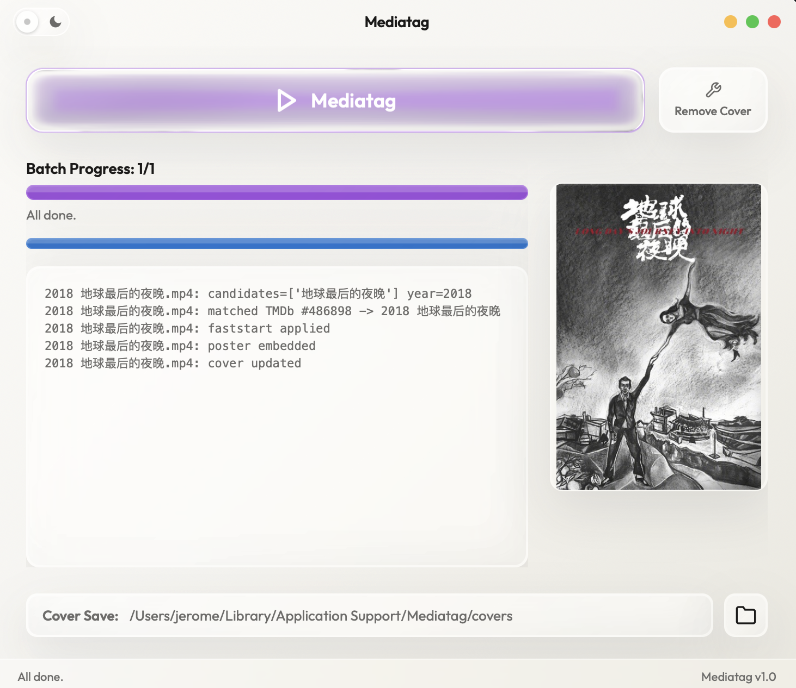
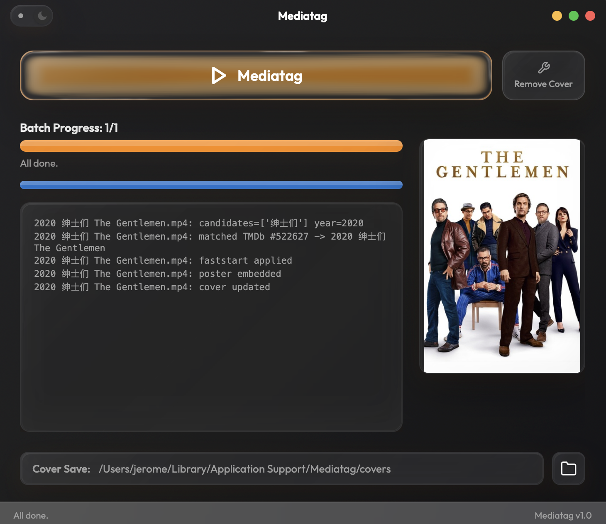
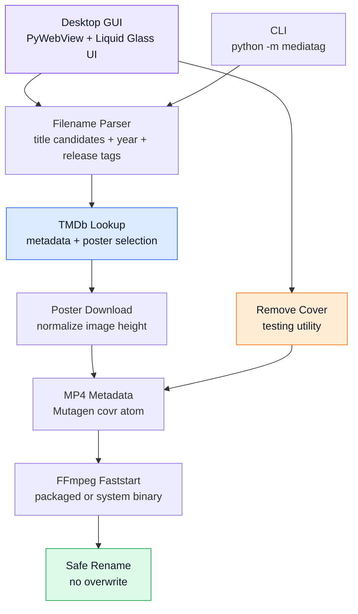

# Mediatag

<p align="center">
  
</p>

<p align="center">
  <strong>一个用于批量整理电影 MP4 的桌面工具。</strong><br>
  <em>A desktop tool for batch-cleaning movie MP4 files.</em>
</p>

> 本文档中文优先，English follows in each major section.

---

## 这是什么 / What It Does

**中文** - Mediatag 是一个干净的公开版桌面应用和 CLI 工具，用来批量整理电影 MP4 文件。它会解析常见的发行文件名，到 TMDb 查询电影信息，下载海报，把封面写入 MP4 metadata，并把文件重命名成更适合媒体库收藏的格式。

**EN** - Mediatag is a clean public desktop and CLI tool for batch-cleaning movie MP4 files. It parses noisy release filenames, looks up movie metadata on TMDb, downloads poster art, embeds the poster into MP4 metadata, and renames files into a tidy media-library format.

---

## 界面预览 / Screenshots

| Light Mode | Dark Mode |
|:---:|:---:|
|  |  |

---

## 核心特性 / Key Features

**中文**

- **批量添加封面** - 从桌面 GUI 选择电影 MP4，自动匹配 TMDb 海报并写入 MP4 cover art。
- **自动重命名** - 把下载站常见的长文件名整理成清爽格式，例如 `2010 盗梦空间 Inception.mp4`。
- **华语和亚洲电影友好** - 对中文、日文、韩文、泰文等片名优先使用本地化标题；英语和部分欧美语系电影保留原名。
- **Remove Cover** - 一键移除 MP4 里已有封面，方便反复测试同一个视频的匹配和写入效果。
- **安全文件行为** - 不覆盖现有文件；如果目标文件名已存在，会自动追加 ` (1)`、` (2)`。
- **清晰跳过不支持格式** - v1 专注 MP4；MKV、AVI、MOV 等格式会被识别并跳过。
- **内置 FFmpeg 支持** - macOS 打包版随应用捆绑 FFmpeg，用于 MP4 faststart 处理。
- **Liquid Glass 风格界面** - PyWebView 桌面壳配合 WebGL/Canvas 效果，提供 Light/Dark 两套视觉。

**EN**

- **Batch cover tagging** - Select movie MP4 files in the desktop GUI, match TMDb posters, and embed cover art into MP4 metadata.
- **Automatic renaming** - Turns noisy release names into clean library names, such as `2010 盗梦空间 Inception.mp4`.
- **Friendly to Chinese and Asian films** - Uses localized titles for Chinese, Japanese, Korean, Thai, and related films; keeps original titles for English and many European-language films.
- **Remove Cover** - Removes existing MP4 cover art with one click, making repeated testing on the same video easy.
- **Safe file handling** - Never overwrites existing files; collisions become ` (1)`, ` (2)`, and so on.
- **Clear unsupported-format handling** - v1 focuses on MP4; MKV, AVI, MOV, and other formats are detected and skipped.
- **Bundled FFmpeg support** - The packaged macOS app includes FFmpeg for MP4 faststart handling.
- **Liquid Glass-inspired UI** - A PyWebView desktop shell with WebGL/Canvas visual effects and Light/Dark themes.

---

## 命名规则 / Rename Format

**中文**

Mediatag 会尽量避免猜错；如果 TMDb 匹配不够确定，或者找不到可用海报，它会跳过该文件。

- 中文或亚洲电影：`2025 火遮眼.mp4`
- 中文标题 + 原始英文标题：`2010 盗梦空间 Inception.mp4`
- 英语电影：`2020 绅士们 The Gentlemen.mp4`

**EN**

Mediatag tries to avoid bad guesses. If the TMDb match is not confident enough or no usable poster is found, the file is skipped.

- Chinese or Asian film: `2025 火遮眼.mp4`
- Localized title + original English title: `2010 盗梦空间 Inception.mp4`
- English film: `2020 绅士们 The Gentlemen.mp4`

---

## 工作流程 / Architecture



**中文** - GUI 和 CLI 共用同一条处理流水线：解析文件名 -> 查询 TMDb -> 下载海报 -> 写入 MP4 metadata -> faststart -> 安全重命名。Remove Cover 是独立工具，主要用于测试和修复已有封面。

**EN** - The GUI and CLI share the same processing pipeline: parse filename -> query TMDb -> download poster -> write MP4 metadata -> faststart -> safe rename. Remove Cover is a separate utility for testing and cleaning existing cover art.

---

## 安装与凭证 / Setup

**中文**

从 [Releases](https://github.com/Na2H2P2O7/Mediatag/releases) 下载 macOS `.dmg` 或 `.zip`。首次使用前，需要准备 TMDb API credential。

打包版 macOS app 推荐把 `.env` 放在这里：

```bash
~/Library/Application Support/Mediatag/.env
```

`.env` 内容可以使用 TMDb Read Access Token 或 v3 API key：

```bash
TMDB_BEARER_TOKEN=your_read_access_token
# or
TMDB_API_KEY=your_v3_api_key
```

TMDb API credential 可以在官方文档和设置页创建：<https://developer.themoviedb.org/docs/authentication-application>

**EN**

Download the macOS `.dmg` or `.zip` from [Releases](https://github.com/Na2H2P2O7/Mediatag/releases). Before first use, create a TMDb API credential.

For the packaged macOS app, put `.env` here:

```bash
~/Library/Application Support/Mediatag/.env
```

The `.env` file can contain either a TMDb Read Access Token or a v3 API key:

```bash
TMDB_BEARER_TOKEN=your_read_access_token
# or
TMDB_API_KEY=your_v3_api_key
```

Create TMDb credentials from the official TMDb docs/settings page: <https://developer.themoviedb.org/docs/authentication-application>

---

## 从源码运行 / Run From Source

```bash
python -m venv .venv
. .venv/bin/activate
pip install -e ".[dev]"
cp .env.example .env
```

Run the desktop app:

```bash
mediatag-gui
```

Or run the module entry:

```bash
python -m mediatag
```

---

## CLI 用法 / CLI Usage

Process a directory:

```bash
mediatag --dir "/path/to/movies" --yes
```

Process specific files:

```bash
mediatag "/path/to/Movie.2025.1080p.mp4" --yes
```

Skip FFmpeg faststart:

```bash
mediatag --dir "/path/to/movies" --yes --no-faststart
```

---

## 开发与测试 / Development

```bash
pytest
```

Run the real TMDb smoke test only when a token is available:

```bash
TMDB_BEARER_TOKEN=... pytest tests/test_tmdb_live.py
```

Build the macOS app locally:

```bash
python -m PyInstaller --noconfirm Mediatag.spec
```

The GitHub Actions workflow also builds a macOS app artifact on push and tag.

---

## 说明 / Notes

**中文**

- v1 只支持 MP4，因为 MP4 和 MKV 的封面 metadata 写入方式不同。
- `.env`、媒体文件、下载的 covers 和 build artifacts 都不会提交到 Git。
- 桌面端 Liquid Glass 效果 vendor 了 MIT-licensed `dashersw/liquid-glass-js` 和 `html2canvas`。
- 当前 macOS release 是 ad-hoc signed，尚未 Apple notarized；第一次打开时 macOS 可能会显示安全提示。

**EN**

- v1 supports MP4 only because MP4 and MKV store cover art differently.
- `.env`, media files, downloaded covers, and build artifacts are ignored by Git.
- The desktop Liquid Glass effect vendors MIT-licensed code from `dashersw/liquid-glass-js` and `html2canvas`.
- The current macOS release is ad-hoc signed but not Apple-notarized; macOS may show a security warning on first launch.
